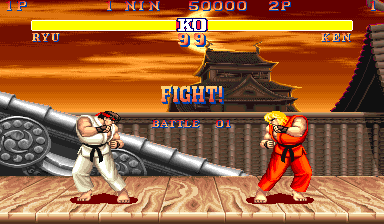

### [Makers Academy](http://www.makersacademy.com) - Week 3 Pair Programming Project

# Battle ⚔️

[Outline](#Outline) | [Task](#Task) | [Installation Instructions](#Installation) | [Functional Description](#Functional_Description) | [User Stories](#User_Stories) | [Objects & Methods](#Methods) | [Testing](#Testing) | [Further improvements](#Further_Improvements)



## <a name="Task">The Task</a>

Write a 'Battle' simulator using a basic project structure with Sinatra, RSpec, and Capybara. The program should allow suer to input player names, attack each other and reduce hit points. The game should annouce a loser if their hit points reach 0.

This challenge is the third pair programming challenge at [Makers Academy](https://github.com/makersacademy).

## <a name="Installation">Installation Instructions</a>

1. Fork this repository, clone to your local machine then change into the directory:
```
$ git clone git@github.com:davmcgregor/Battle.git
$ cd Battle
```
2. Load dependencies with bundle:
```
$ gem install bundle
$ bundle
```
3. Run Rspec for tests and coverage, then rubocop for linting
```
$ rspec
$ rubocop
```
4. Run the app on a local server and play on the broswer: http://localhost:4567/

```Shell
$ ruby app.rb -p 4567
```

## <a name="Functional_Descriptions">Functional Descriptions</a>

The system's functionality includes:

* Two __players__ can fill and __submit__ a form to display their names.
* A player can click __attack__ to reduce __hit points__ from another player if it is their turn.
* A player can click __OK__ after their attack to switch turns.
* A __loser__ will be announced if their __hit points__ reach 0.

## <a name="User_Stories">User Stories</a>
```
As two Players,
So we can play a personalised game of Battle,
We want to Start a fight by entering our Names and seeing them
```
```
As Player 1,
So I can see how close I am to winning
I want to see Player 2's Hit Points
```
```
As Player 1,
So I can win a game of Battle,
I want to attack Player 2, and I want to get a confirmation
```
```
As Player 1,
So I can start to win a game of Battle,
I want my attack to reduce Player 2's HP by 10
```
```
As two Players,
So we can continue our game of Battle,
We want to switch turns
```
```
As Player 1,
So I can see how close I am to losing,
I want to see my own hit points
```
```
As Player 1,
So I can lose a game of Battle,
I want Player 2 to attack me, and I want to get a confirmation
```
```
As Player 1,
So I can start to lose a game of Battle,
I want Player 2's attack to reduce my HP by 10
```
```
As a Player,
So I can Lose a game of Battle,
I want to see a 'Lose' message if I reach 0HP first
```

## <a name="Methods">Objects & Methods</a>

For the user stories I created a domain model for each object, including attributes and behaviour:

### Attack

| Methods | Description |
| --- | --- |
| initialize(player)| Creates a new instance of Attack and sets a player instance variable |
| .self.run(player) | Instance method applies 'run' on player argument |
| run | Applies 'receive_damage' to player variable |

### Game

| Methods | Description |
| --- | --- |
| self.create(player_1, player_2) | Class method that creates a game with two players |
| .self.instance | Class method that returns the game class instance variable  |
| initialize(player_1, player_2) | Sets two instance variables: players array and current turn  |
| player_1 | Returns the first player in the players array |
| player_2 | Returns the last player in the players array |
| switch_turns | |
| opponent_of(player) | changes the current turn variable using the players_who_are_not(player) method |
| game_over? | returns players using the losing_players method |
| loser | returns the first losing_player |
| losing_players | private method that selects any player with 0 hit points |
| players_who_are_not(the_player) | returns player that is not the player passed in as an argument |

### Player

| Methods | Description |
| --- | --- |
| initialize(name, hit_points = DEFAULT_HIT_POINTS) |  Sets instance vaiables name and hit points at a default of 100 |
| receive_damage | Reduces the hit points variable by 10 |

## <a name="Testing">Testing</a>

Tests were written with RSpec and Capybara. To run the tests in terminal: 

```bash
$> cd Battle
$> rspec
```

## <a name="Further_Improvements">Further Improvements</a>

Test and implement these Extension Stories:

```
As a Player,
So I can play a suspenseful game of Battle,
I want all Attacks to deal a random amount of damage
```
```
As a lonely Player,
So I can keep my Battle skills up to scratch
I want to play a Computerised opponent
```
```
As a Player,
So I can enjoy a game of Battle with more variety,
I want to choose from a range of attacks I could make
```
```
As a Player,
So I can better enjoy a game of Battle,
I want some of my attacks to Paralyse an opponent (chance of losing their next attack)
```
```
As a Player,
So I can better enjoy a game of Battle,
I want one of my attacks to have a chance of Poisoning my Opponent (Opponent takes a small random amount of damage at the beginning of their turn)
```
```
As a Player,
So I can better enjoy a game of Battle,
I want to make an attack that has a chance of sending my Opponent to Sleep (Opponent definitely misses next turn)
```
```
As a Player,
So I can extend my joyous experience of Battle,
I want to have an attack that heals some of my Hit Points
```
```
As a Player,
So I can enjoy my game of Battle,
I want a sexy user interface
```